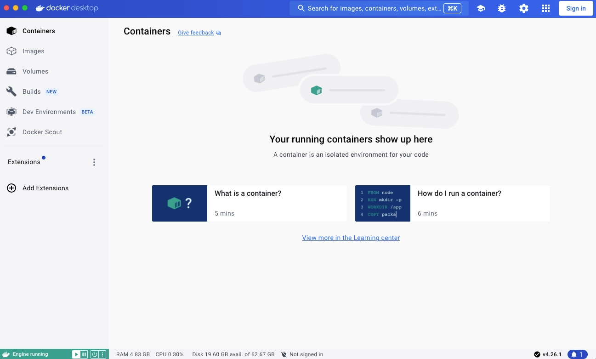
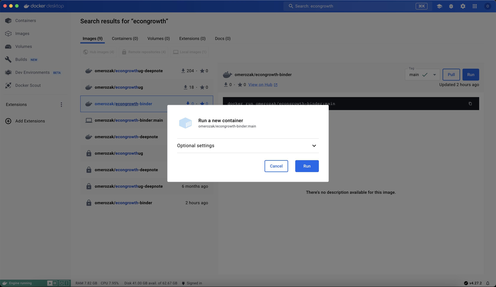
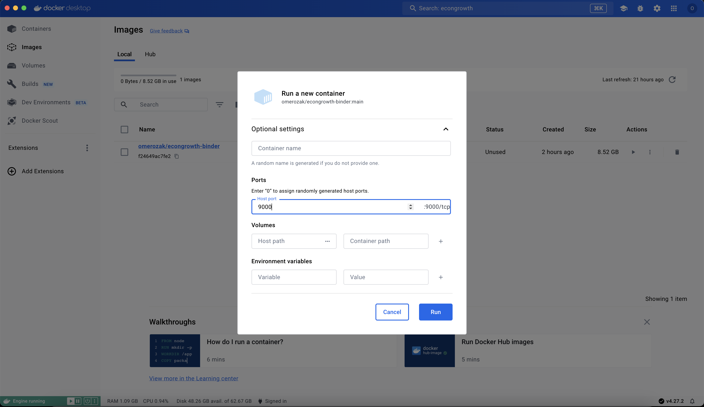
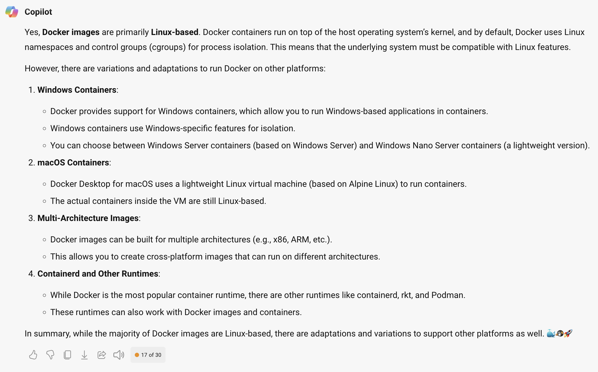
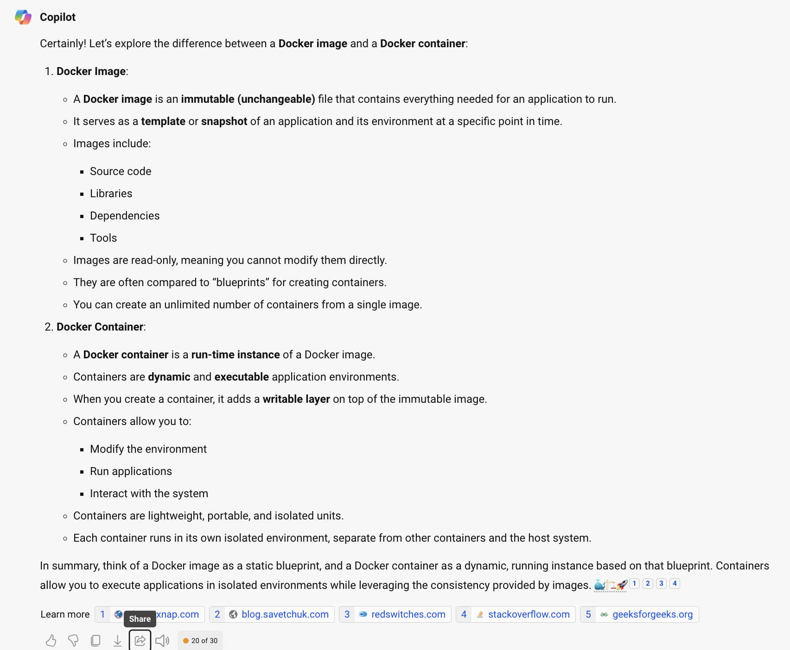

Title: Using Docker for computation
Slug: Docker
Category: Computation, Dynamic Programming, IPythonmain
date: 2024-02-17 12:00
Tags: Computation, IPython, Python, QGIS
Author: Ömer Özak

---

**[Docker](https://www.docker.com/)** is an open platform for developing, shipping, and running applications. While originally created for software and app production, it is very useful for scientists to generate replicable environments for use. So we can use **[Docker](https://www.docker.com/)** to create environments for our own use, or to share our research with others. If you are interested in more technical details, you can learn more about **[Docker](https://www.docker.com/)** [here](https://docs.docker.com/get-started/overview/).

The following steps explain how you can use **Docker containers and images** to create or run code on your computer, as well as instruction on how to create your own **Docker containers and images** using **Dockerfiles**. 

## Get Docker

<iframe src="https://docs.docker.com/get-docker/" title="Get Docker" width=90% height=1000px></iframe>

## Using Docker

After installation finishes, continue by openining the **Docker Desktop** application on your computer. You should see something like this

### Sign in
Next, create a **[Docker](https://www.docker.com/)** account and sign in using the button on the upper right corner (make sure to save your username and password).

### Search for a **[Docker](https://www.docker.com/) Image and Run it**

Click on **Images**,then search for `econgrowth-binder`, and click run as shown in this video.

<video width="100%" height="300" controls autoplay loop>
  <source src="../images/pics/fun/docker-image-search-run.mov" type="video/mp4">
</video>

Since the image is large, it will take a while to download. Once it does you should see the following

Click on **Optional Settings** and set `host port` to `9000` 

Click on **Run**, then click on the blue port number 9000:9000. This will open `jupyterlab` in your browser. When asked input `docker` as the token to get started

<video width="100%" height="300" controls autoplay loop>
  <source src="../images/pics/fun/docker-econgrowth-open-port-run.mov" type="video/mp4">
</video>

Now you are ready to work with Jupyter and Docker! Remember that you do not need to use only the **Docker Image** from teh course, you can search and find any **Docker Image** that serves your purposes.

# A few things to be careful about

* If you delete the **Docker Container**, and have not exported/saved your work into an external drive, you will loose EVERYTHING you have done! So, it is best to link an external drive to your caontainer. Here's how to do it:
	* When click on **Optional Settings**, besides setting the `host port` to `9000`, select a folder on your computer that you want to use with this container and give it a name inside the  **Docker Container**. E.g., I will use the folder `my_work` on my laptop which I will link to the folder `/my_work` in the **Docker Container** (notice the `/` before the folder name)

<video width="100%" height="300" controls autoplay loop>
  <source src="../images/pics/fun/docker-econgrowth-open-port-run-withdrive.mov" type="video/mp4">
</video>

* You can simultaneously have multiple **Docker Container** based on the same  **Docker Image**. Each doing something different.
* You can name your **Docker Container**, so you remember what it is. This is especially useful in case you need to stop and continue later. 
* Brfore stopping the container, makle sure you have saved all your work in the external drive. When you resume the **Docker Container** will not resume where you left off otherwise. Imprtantly, it will not keep computations.

## Understanding Docker files

There are basically three files that are used in a **[Docker](https://www.docker.com/)** workflow:

1. **Dockerfile**: This is a text file that has the instructions to create a **Docker container**. E.g., the fillowing is the **Dockerfile** that creates a **Docker image** with the conda environment we use in the course.

<iframe src="https://www.dropbox.com/scl/fi/hx85qjme4nujyayzgtobf/Dockerfile?rlkey=9hgsquhw8mqmmreotikendhxr&raw=1" title="Dockerfile" width=100% height=200px></iframe>

As you can see parts of it are running the same instructions we use in [Manual Anaconda Install](https://econgrowth.github.io/pages/Manual%20Anaconda%20Install.html). You can create your own using this file or any other you find on the web (or ask ChatGPT to help you write one for your own use-case).
2. **Docker Image**: This is the result of compiling the **Dockerfile**. It basically generates a self-contained computational environment that has all the software, apps,  packages, data, code, etc. that were created and installed as part of the **Dockerfile**. Think of it as a virtual drive that has the operating system (OS) and all the things you need/want to use as defined in your **Dockerfile**, and which you will run on your computer/laptop/cloud. What this means is that you can create a **Docker Image** based on one kind of OS and run it on others. Most **Docker images** are linux based, but you can also create images based on other OS. Specifically, according to [Bing Copilot](https://sl.bing.net/iv3vtZTcbn2),

3. **Docker Container**: This is a run of a  **Docker Image**, think of it as opening that virtual drive and running the OS and code inside it. This allows you to use the code, apps, data, etc. that are in the **Docker Image**. 

### Wait...what? What is the difference

I know, this is kind of weird...or perhaps I cannot explain it that well. Let's see if [Bing Copilot's](https://sl.bing.net/i5v3O3rGkUe) answer,

