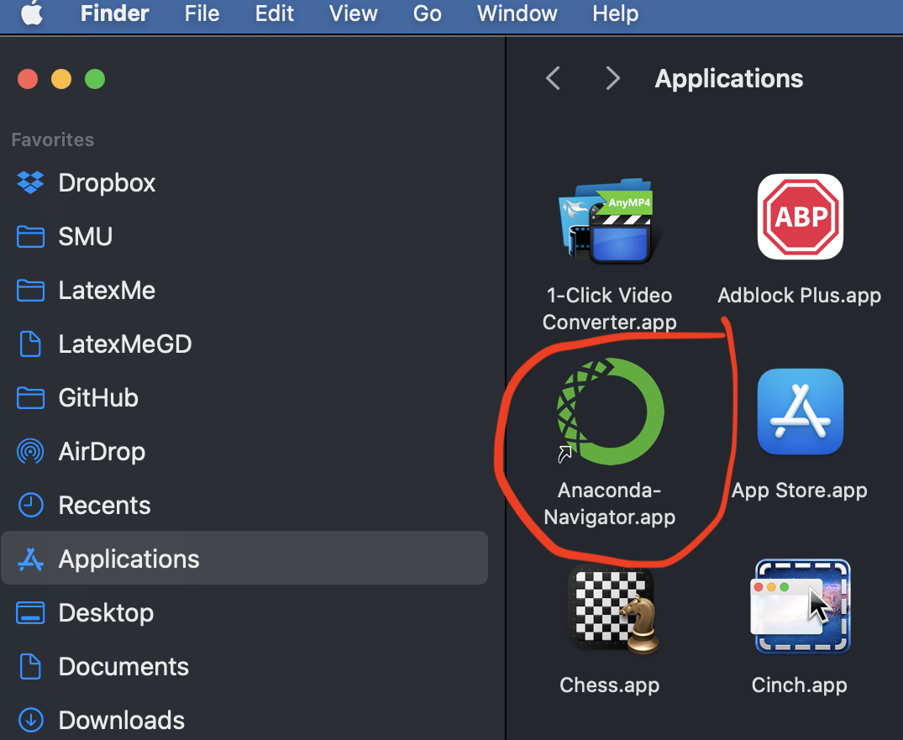
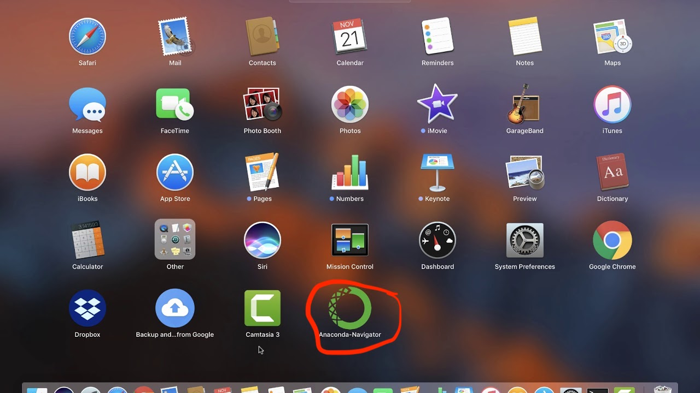
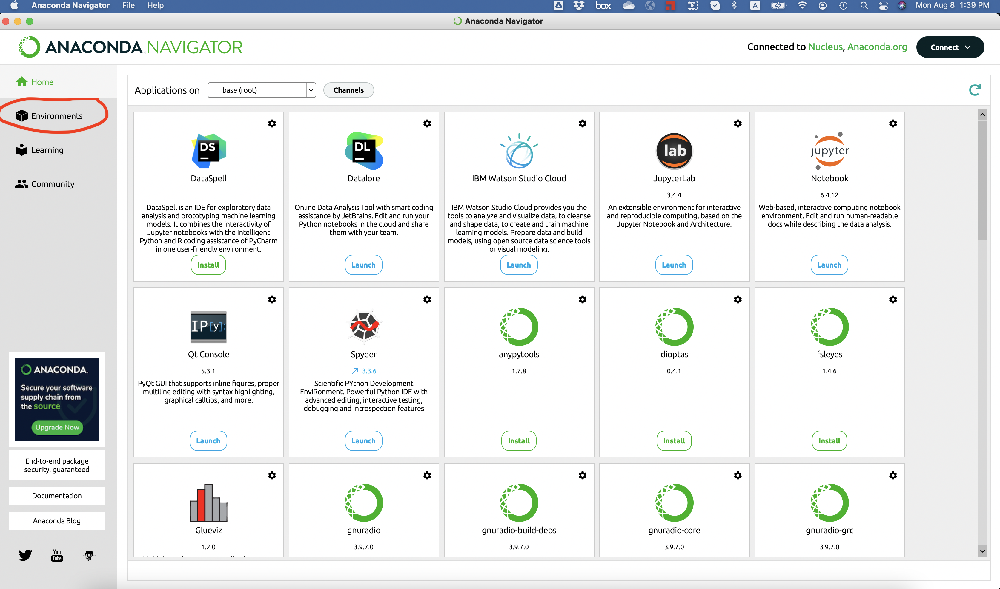
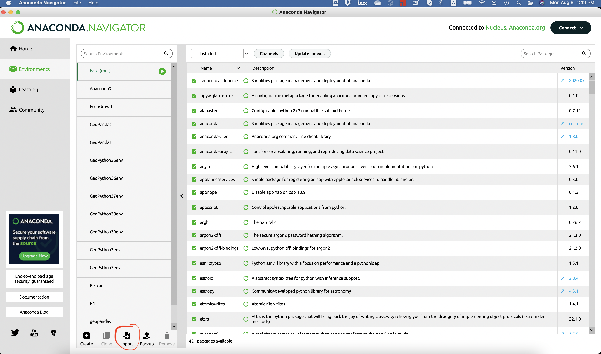
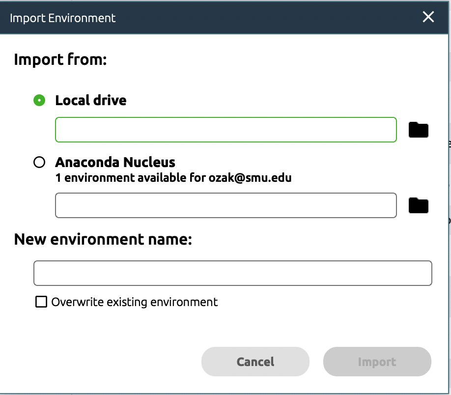
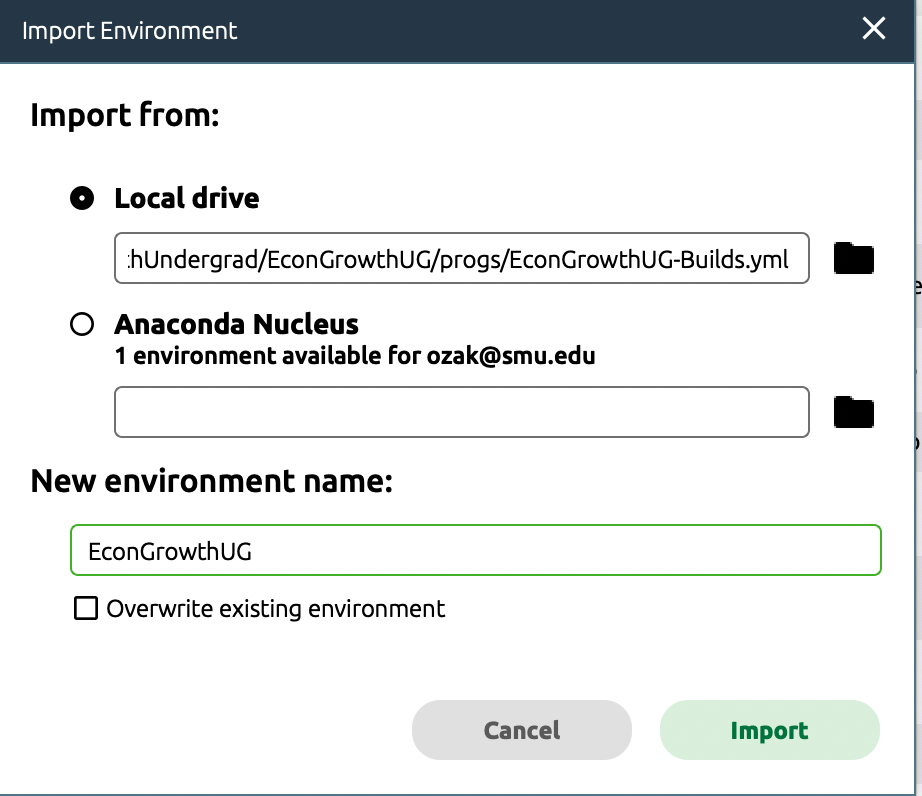
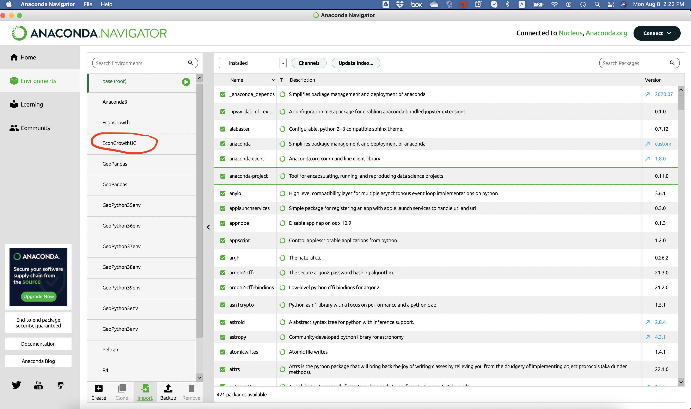

Title: Point and Click Instructions
date: 2022-01-26 13:53
Author: Ömer Özak
Slug: Point and Click

---

1.  Download the following YAML file to the progs subfolder in the EconGrowth folder you created in the previous step.
    *   Mac & Linux: Use [this YAML file](https://www.dropbox.com/s/cxm3nv8cv2y5z3v/EconGrowthUG-Builds-RISE.yml?dl=0)
    *   Windows: Use [this YAML file](https://www.dropbox.com/s/22p06rk0ez9ka1x/EconGrowthUG-Builds-Windows-pip.yml?dl=0)
2.  Start the [Anaconda-Navigator](https://docs.anaconda.com/anaconda/navigator/). 
    
    *   Windows: From the Start menu, click the Anaconda-Navigator desktop app or search for `anaconda navigator`.  
          
        
    
      
    
    *   Mac: In Finder open the Applications folder and click on the Anaconda-Navigator icon  
           
        
    
      
    
    Or, open Launchpad, then click the Anaconda-Navigator icon.
    
      
      
    *   Linux: Open a terminal window and type `anaconda-navigator`.  
          
        
3.  Once you start Anaconda-Navigator you should see something like this.  
      
      
      
    
4.  Click on Environments in the left menu.  
      
      
      
    
5.  You should now see something that looks like this  
      
      
      
    
6.  Click on Import in the bottom menu  
      
      
      
    
7.  In the new window, select Local Drive, find the EconGrowth/progs folder, and select the EconGrowthUG-Builds.yml file you downloaded to create the environment. Make sure to change the name of the environment to EconGrowthUG.  
      
        
      
    
8.  The installation should take about 10 minutes. Once it finishes you should see the new EconGrowthUG environment in the list on the left.  
      
    