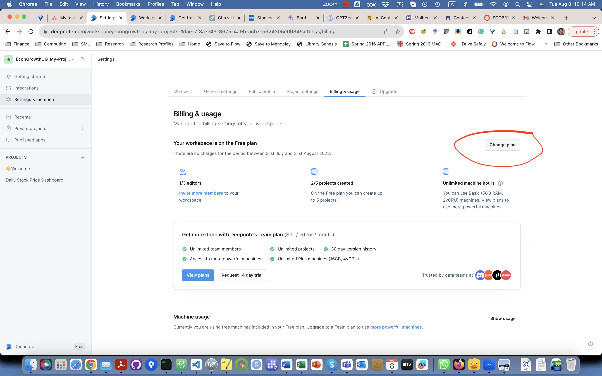

Title: Create Deepnote Account
Slug: Create Deepnote Account
Category: Computation, Dynamic Programming, IPythonmain
date: 2016-12-29 13:53
Tags: Computation, IPython, Python, QGIS
Author: Ömer Özak

[Deepnote](https://deepnote.com/) is a (free) online computational notebook service.

## Step-by-step guide

1.  Head over to [Deepnote](https://deepnote.com/) and click on [Get Started](https://deepnote.com/sign-up). 
 
      
      
    
2.  Click. on Sign up with email.  

      
      
    
3.  Sign up using your email address. **If you use an .EDU email we recommend using it**. Make sure to follow the instructions and prove you are a human!  

      
      
    
4.  The system will send you an email to verify your account. Open your email inbox and click on the "Sign in now" image/button in the email from Deepnote. If you did not get one, check your Junk Mail Folder.  

      
      
    
5.  Fill out your personal information to be used with the account  

      

You should be all set to start using Deepnote. To log in, you will use your email and use the link you get in your mail's inbox. No passwords or anything (so far). 

## Access to our Deepnote project

To view and execute our code you can access our [Deepnote project](https://deepnote.com/join-team?token=1caea1e0f7cc466) or its notebooks directly:

- [Report Tables and Figures](https://deepnote.com/workspace/replication-dickens-2022-ff5e06ca-d8fd-4344-b73c-7d07c01f9c63/project/1-Report-Tables-and-Figures-2158a300-6955-4725-92f2-79476c32a378) 
    - This notebook produces all the figures and tables found in the report.

- [Construction of the Alternative Data](https://deepnote.com/workspace/replication-dickens-2022-ff5e06ca-d8fd-4344-b73c-7d07c01f9c63/project/2-Construction-of-the-Alternative-Data-4a945f27-2c4c-4244-8f3b-ab6dff812a2f)
    - This project uses the Ethnologe v16 and v17 to reconstruct buffer zones used in the replication report. Due to Ethnologue's copyright, you will not be able to execute most of the notebooks as the underlying data is not available (if you have an Ethnologue license you should be able to run after changing the path to the location of Ethnologue). However, you can view how we constructed the data and each cell output. This should allow you to use similar tools and approaches for your own work.

## Upgrade to Education Plan      
    
If you created your account with a .EDU email you can access the educational benefits.

FYI, you can use your GMAIL account if you prefer in step 2 in the *Step-by-step guide* section. Then use your institutional email account to verify your educational status and still get the free tools and account upgrades. The only difference (as far as I can tell) is how you log in.

1.  Click on **Billing & usage**.  

      
      
    
2.  Click on **Change plan**.  

      
      
    
3.  Now, you should be on the **Upgrade** page. Click on **Upgrade to Education**.  

      
      
    
4.  Use your YOUREMAIL@SMU.EDU to fill out the required information.  

      
      
    
5.  The system will send you another verification email. Click on **Verify my email**.  

      
      
    
6.  Now, you should see a **Welcome to Education Plan** message.  

      

If you want to find out more about the [Educational Plan](https://deepnote.com/docs/edu-verification) or have issues, check out their [information website](https://deepnote.com/docs/edu-verification).  You can also chat with them if you need support or ask questions in their [community forum](https://community.deepnote.com/home).